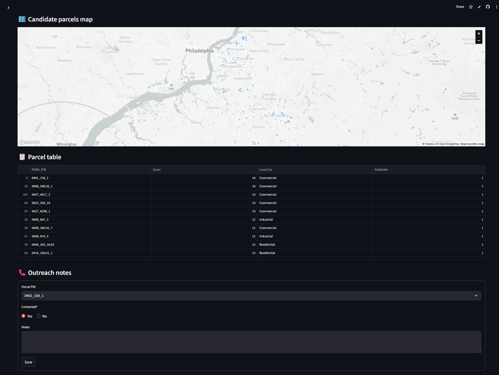

# GridScout AI ⚡

[]((https://gridscoutai-ahauz9mzzxpt7hxw7ymvrn.streamlit.app/))


> **AI‑powered GIS tool** to discover, score, and manage high‑value land parcels for clean‑energy development (solar, battery storage, etc.).

<p align="center">
  <!-- Replace with your own image -->
  
</p>

---

## Key Features

| Feature | Description | Status |
|---------|-------------|--------|
| **Parcel Scoring** | Combines lot area, zoning compatibility, distance to substation, flood & wetlands risk | ✅ |
| **Interactive Dashboard** | Streamlit map with filters, tooltips, data table | ✅ |
| **Outreach Log** | Track landowner contacts and notes (CSV persistence) | ✅ |
| **AI Letter Generator** | GPT‑powered personalized outreach letters | 🚧 Planned |
| **Multi‑County Batch Processing** | Run scoring pipeline for any NJ county | 🚧 Roadmap |

---

## Quick Start (local)

```bash
git clone https://github.com/sadnomnom/GridScoutAI.git
cd GridScoutAI

# Install core dependencies
pip install -r requirements.txt        # or: conda env create -f environment.yml

# Launch the dashboard
cd dashboard
streamlit run app.py
